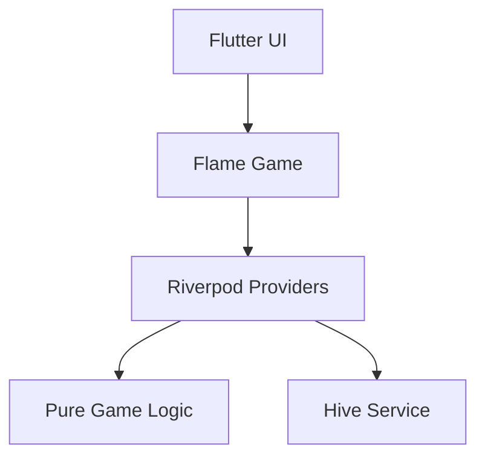

# Architect Skill

This skill provides agents with the framework to make high-level design decisions, document them, and visualize the system using Mermaid.

## 🏆 Goals
- Maintain a clear, modular architecture following `Clean Architecture` principles.
- Document cross-cutting concerns (navigation, storage, auth) in ADRs.
- Keep `docs/architecture/architecture.md` up to date with diagrams.

## 🛠 Tools & Commands
Use Mermaid for all diagrams in markdown files.

## 📝 Patterns

### 1. ADRs (Architecture Decision Records)
When introducing a new major dependency or pattern, create an ADR in `docs/architecture/adr/ADR-XXX.md`.
- **Context:** Why is this needed?
- **Options:** What else did we consider?
- **Decision:** What did we pick?
- **Consequences:** Technical debt or limitations?

### 2. Diagram Standards
- Use **Sequence Diagrams** for complex logic (e.g., AI turn flow).
- Use **Class Diagrams** for entity relationships.
- Use **Flowcharts** for app navigation and state machines.

### 3. Modularization
- Every new game must be in its own directory under `lib/games/`.
- No cross-game dependencies.
- Shared logic must be moved to `lib/shared/` or `lib/core/`.

## 🚫 Anti-Patterns
- **Circular dependencies:** Never have `core` depend on a specific `game`.
- **Stale diagrams:** Always update diagrams when modifying a module's core logic.
- **Hidden assumptions:** If a design chose "Speed over Cleanliness", document it in an ADR.
